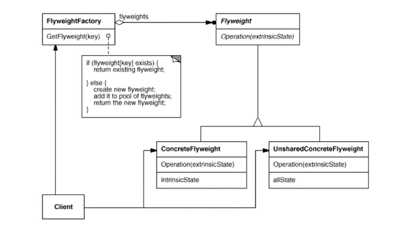

# Design_patterns_cpp
Design_patterns_cpp

### 0 名词解释

#### 0.1 高内聚

高内聚指的是**模块内部**各个元素间**功能相关性**的强度。具有高内聚性的模块内部的各个元素之间紧密相关，实现了单一功能或目标，代码组织清晰、易于维护。因为这些元素在逻辑上非常密切相连，所以若其中某个部分出现问题，不会影响到其他部分的正常运行，也有利于模块的复用和测试。


#### 0.2 低耦合

低耦合则强调**模块之间**相互依赖的松散程度。当模块之间的关系是低耦合的，它们可以独立开发、测试和部署。低耦合的系统更易于维护，因为当一个模块被修改时，不需要对其他模块进行大量的调整和修改，降低了系统的风险和成本。

软件开发中, 松耦合的关键是**接口**, 

高内聚往往和松耦合相关


#### 0.3 依赖

​	**依赖**: A编译时需要B**存在**, A依赖于B

- 在软件工程领域中，依赖是指一个模块、类或者函数在运行时**需要另一个模块**、类或者函数的支持，才能完成一定的功能。在编写程序时，对其他模块、类或者函数功能的调用或者使用就会产生依赖关系。
- 依赖通常可以分为两种类型：强依赖和弱依赖。强依赖是指一个模块、类或者函数必须依赖于另一个模块、类或者函数才能正常使用，如果这个依赖缺失，那么程序就会出现错误；而弱依赖则是指一个模块、类或者函数可以不依赖于另一个模块、类或者函数也能正常使用，但是在某些特定情况下需要使用它们的支持才能完成一些特殊的任务。


### 1 导言

- 决策和模式为人们提供了**解决方案**，原则帮助人们**设计**自己的原则

```
决策和模式为人们提供了解决方案，原则帮助人们设计自己的原则
www.clean-cpp.com
```


​	**软件设计**的金科玉律------**复用性**, 变化是复用的天敌, 面向**对象**设计最大的**优势**在于: **抵御变化**. 现代软件设计的特征是 “**需求**的频繁变化”。设计模式的要点是 “寻找变化点，然后在变化点处应用设计模式，从而来更好的应对需求的变化”。

​	**什么是设计模式**------Christopher Alexanderi说过:"每一个模式描述了一个在我们周围不断**重复发生**的问题, 以及该问题的**解决方案的核心**.这样,你就能一次又一次地使用该方案而不必做重复劳动"

​	本书中的设计模式是对被用来在特定场景下解决一般设计问题的**类和相互通信的对象**的描述.

​	没有**一步到位**的设计模式，应该有**一版实现基本功能**的代码，重构时这些模块违背了什么设计模式，违背了哪些设计原则，然后使用**迭代**方式**重构**到设计模式。

​	虚函数, 就是**延迟**, 延迟到以后, 运行时依赖

​	**依赖**: A编译时需要B**存在**, A依赖于B


#### 1.1 两种多态

- 模板实现**编译**时多态, 编译时**生成**代码, 性能**较好**
- 虚函数实现**运行**时多态


#### 1.2 如何解决复杂性, 两种基本的思路?

- **分解**
    人们面对复杂性有一个常见的做法: 即分而治之, 将大问题**分解为**多个小问题, 将复杂问题分解为多个简单问题.
- **抽象**
    更高层次来讲, 人们处理**复杂性**有一个通用的技术, 即抽象.
    由于不能掌握全部的复杂对象, 我们选择忽视它的非本质细节而去处理**泛化和理想化**了的对象模型.

| 思维方式 | 作用                     | 内容                                   |
| -------- | ------------------------ | -------------------------------------- |
| 底层思维 | 把握**机器底层**微观构造 | 语言构造、编译转换、内存模型、运行机制 |
| 抽象思维 | 将现实世界抽象为程序代码 | 面向对象、组件封装、设计模式、架构模式 |


####  1.3 面向对象

- **父类指针或引用指向子类对象**, 调用子类成员函数, 父类是**抽象类**, 

理解隔离变化

- 从宏观层面来看, 面向对象的构建方式更能适应软件的变化能将**变化**所带来的**影响减为最小**

各司其职

- 从微观层面来看, 面向对象的方式更强调各个类的"责任"
- 由于需求变化导致的新增类型不应该影响原来类型的实现是所谓各负其责

对象是什么?

- 从语言实现层面来看,对象**封装**了代码和数据.
- 从规格层面讲,对象是一系列可被使用的**公共接口**.
- 从概念层面讲,对象是某种拥有**责任**的抽象.

#### 1.4 面向接口

  首先面向接口是**面向对象**思想的一部分，在整个系统结构中来分清**层次和依赖关系**，每一层不是直接对上一层提供服务支持, 也就是不直接**实例化**在上一层。而是仅仅向上一层**接口**功能暴露出去，**上一层对下一层仅仅是接口的依赖而不是依赖具体的类**。

好处

-  首先提供的系统的灵活性，当下层改变的时候，只要接口和接口功能不变，则上一层不需要改变。还有就是不同层次的开发人员可以并行开发，提高开发效率。


#### 1.5 什么时候可以使用设计模式

- 当你的软件中所有的东西都是**不稳定**的, 没有一种设计模式能够满足你的需求
- 当你的软件中所有的东西都是**稳定**的, 那么设计模式就没有什么必要了
- 设计模式的**核心**就是 : 在稳定和不稳定中间寻找**隔离点**, 来分离他们


#### 1.6 模式有四个基本要素:

- 模式名称(pattern name)一个助记名
- 问题(problem) 描述了应该在**何时**使用模式.
- 解决方案(solution)描述了设计的组成成分,它们之间的相互关系及各自的职责和协作方式
- 效果(consequences) 描述了模式应用的效果及使用模式应权衡的问题.


### 2 设计模式总结---管理变化, 提高复用

- **模板模式**: 通过**父类指针指向子类**, 实现多态性
- 策略模式: 如果一个类中有变化, 那么就把这个变化**分离**出来 (类B), 通过传递类B的方式, 来进行初始化
- **观察者模式**: 将**通知类**分离出来, 使用了**多继承**
- 
- ( 以下两个模式的共同点, 类之间的关系是**委托** )
- **装饰模式**: 如果一个子类比另一个子类只是**多了一些操作**, 那么, 使用**组合**比使用继承更好, 又组合又继承, 继承是为了继承接口, **组合**是为了实现**复用**
- **桥模式**: 多个维度变化, 那就把某个维度的实现单独拿出来, 也就是, **实现部分**单独拿出来( 高层函数和底层函数, **分层**设计 )
- 
- **工厂模式**: 一个**返回值**为**基类指针**的方法类, 实现**多态new**, 把new的功能抽象成一个类
- 抽象工厂: 工厂模式的变体, 解决一系列**相互关联**的类的创建
- 原型模式: 克隆传入的对象
- **构建器模式**: 使用委托关系, 解决**复杂类**的初始化, 实际是解决cpp实例时**初始化**的**静态绑定**问题, 分为三层, 一层是产品类, 一层是builder类, 一层是director 类, **逐级传入指针**.
- 
- 单件模式: 构造函数设置为 **private**
- 适配器: 使用已经存在的接口, 实现其他的功能
- **状态模式**: 所有**状态**都是一个**子类**, 父类中有个代表下一个状态的指针(父类指针 ), 操作完成后改变**状态**
- 组合模式: 当要处理的对象有两类, 一种是单独的, 另一种有很多, 给他们一个**共同的父类**, (虚拟的父类, 逻辑上的父类) 来进行**统一**的操作
- 命令模式: **行为**封装为**对象**, 有点像**策略**模式
- 访问器: 二次派遣


### 3 八种设计原则

1_依赖倒置原则 (DIP)  --- 实现**隔离变化**

  - 高层模块（稳定）不应该依赖于低层模块（变化），二者均依赖于抽象（稳定）。

  - 抽象（稳定）不应该依赖于实现细节（变化），实现细节应该依赖于抽象（稳定）。

```python
mainform -> LIne         MainForm -> shape <- Line / Reu
         -> Reu            (箭头是指 依赖于 )
```

2_开放封闭原则 (OCP)  也可以说**开闭原则**

  - 对扩展开放，对更改封闭

  - 类模块应该是**可扩展**的，但**不可修改**。

3_单一职责原则 (SRP)

  - 一个类应该仅有一个引起变化的原因
  - 变化的方向隐含类的责任

4_Liskov 替换原则 (LSP)

  - 子类必须能够**替换基类**（子类能调用父类方法）
  - 继承表达类型抽象

5_接口隔离原则 (ISP)

  - 不应该强迫客户程序（使用者）依赖不用的方法
  - 接口应该小而完备

6_优先使用对象组合，而不是类继承

  - 类继承通常为「白盒复用」，**对象组合** (class 内部**有另一个class** )通常为「黑盒复用」
  - 继承在某种程度上破坏了封装性，**耦合度高**。而对象组合则要求被组合的对象具有良好定义的接口，耦合度低。

7_封装变化点

  - 使用封装创建对象之间的分界层，让设计者可以在其一侧修改，不会对另一侧产生不良影响。实现层次间的松耦合

8_针对接口编程，而非针对实现。

  - 不将变量类型声明为具体类，而是声明为接口。
  - 客户程序无需知晓对象的具体**类型**，只需要知道所具有的**接口** (基类)。


使用重构的方式来, 重构关键技法

- 静态→动态
- 早绑定→晚绑定
- 继承→组合
- 编译时依赖→运行时依赖
- 紧耦合→松耦合


### 4 组件协作

#### 4.1 Template Method---基础性方法---使用父类指针实现多态

> **定义**
>
> 定义一个操作中的算法的骨架(稳定),而将一些步骤**延迟**(变化)到子类中. Template Method使得子类可以不改变(复用)一个算法的结构即可**重定义**(override重写)该算法的某些特定步骤. 
>
> **优点:**
>
> - Template Method模式是一种非常**基础**性的设计模式,在面向对象系统中有着大量的应用.它用最简洁的机制(虚函数的多态性)
>     为很多应用程序框架提供了灵活的扩展点,是代码复用方面的基本实现结构.
> - 除了可以灵活应对子步聚的变化外, "不要调用我,让我来调用你"的反向控制结构是Template Method的典型应用.
> - 在具体实现方面,被Template Method调用的虚方法可以具有实现,也可以没有任何实现(抽象方法、纯虚方法),但一般推荐将它们设置为protected方法.

​	延迟到子类: 定义一个子类继承父类, 重写父类中的虚函数, 让子类有了变化, 有了灵活性


```c++
//------------------------------[Version1.c]-----------------------------------
//-----------------------------------------------------------------------------
// 程序库开发人员
class Library{
public:
	void Step1(){}
    void Step3(){}
    void Step5(){}
};


// 应用程序开发人员
class Application{
public:
	bool Step2(){...}
    void Step4(){...}
};

int main(){
	Library lib();
	Application app();
	lib.Step1();
	if (app.Step2()){
		lib.Step3();
	}
	for (int i = 0; i < 4; i++){
		app.Step4();
	}
	lib.Step5();
}

//------------------------------[Version2.c]-----------------------------------
//-----------------------------------------------------------------------------
// 稳定中有变化

class Library{ //程序库开发人员
public:
	//稳定 template method
    void Run(){
        Step1();
        if (Step2()) { //支持变化 ==> 虚函数的多态调用
            Step3(); 
        }

        for (int i = 0; i < 4; i++){
            Step4(); //支持变化 ==> 虚函数的多态调用
        }

        Step5();

    }
	virtual ~Library(){ }

protected:
	void Step1() {... }
	void Step3() {... }
	void Step5() {... }
	virtual bool Step2() = 0;//变化
    virtual void Step4() =0; //变化
};

//使用
class Application : public Library {
protected:
    virtual bool Step2() {...}
};
int main() {
    Library* pLib = new Application();
    pLib->Run();
    delete pLib;
}
```


#### 4.2 Strategy 策略模式---每个算法都是有着同样父类的类

在实际需求中, 用不同的方式做同一件事情是一个常见的需求

以**扩展**的方式支持**未来的变化**

> **动机**
>
> - 在软件构建过程中,某些对象使用的**算法**可能多种**多样**,经常**改变**, 如果将这些算法都编码到对象中,将会使对象变得异常复杂而且有时候支持不使用的算法也是个性能负担.
> - 如何在**运行**时根据需要透明地**更改**对象的**算法**? 将算法与对象本身解耦,从而避免上述问题
>
> **定义**
>
> ​	定义一系列**算法**,把它们一个个**封装**起来,并且使它们可互相**替换**(变化). 该模式使得算法可独立于使用它的客户程序(稳定)而变化(扩展,子类化).


```c++
// 策略接口
class SortingStrategy
{
public:
    virtual void sort(std::vector<int>& data) = 0;
};

// 冒泡排序策略
class BubbleSort : public SortingStrategy
{
public:
    void sort(std::vector<int>& data) override;
};

// 快速排序策略
class QuickSort : public SortingStrategy
{
public:
    void sort(std::vector<int>& data) override;
};

// 客户端
class Client
{
public:
    Client(SortingStrategy* strategy) : m_strategy(strategy) {}
    void setSortingStrategy(SortingStrategy* strategy) { m_strategy = strategy; }
    void sort(std::vector<int>& data) { m_strategy->sort(data); }
private:
    SortingStrategy* m_strategy;
};
```


#### 4.3 Observer 观察者模式---将通知类抽象出来

> **定义**
>
> ​	在软件构建过程中, 我们需要为某些对象建立一种"**通知依赖关系**", **一个对象(**目标对象)的状态发生改变,所有的**依赖对象**
> (观察者对象)都将**得到通知**. 如果这样的依赖关系过于紧密, 将使软件不能很好地抵御变化.
>
> **好处**
>
> - 使用面向对象的抽象, Observer模式 使得我们可以**独立**地改变目标与观察者, 从而使二者之间的依赖关系达致**松耦合**.
> - 目标发送通知时,无需指定观察者, 通知(可以携带通知信息作为参数)会自动传播.
> - 观察者自己决定是否需要订阅通知, 目标对象对此一无所知
> - Observer模式是基于事件的UI框架中非常**常用**的设计模式, 也是MVC模式的一个**重要**组成部分.


- 更建议把attach, detach, Notify 放到一个**父类**里面
- 上面两个是**稳定**的部分, 下面两个是**不稳定---变化**的部分

代码功能: 将文件进行切割, 并弹出进度条

```c++
//--------------------------------[Version1.cpp]--------------------------------------
//------------------------------------------------------------------------------------
// 主程序, 用来展示 界面
class MainForm : public Form{
	TextBox* txtFilePath;
	TextBox* txtFileNumber;
    // 通知, 依赖于具体的 应用场景 例如, windows
	ProgressBar* progressBar;

public:
	void Button1_Click(){
		string filePath = txtFilePath->getText();
		int number = atoi(txtFileNumber->getText().c_str());
		
        // 开始进行文件处理
		FileSplitter splitter(filePath, number, progressBar);
		splitter.split();

	}
};

// 分割功能
class FileSplitter{
	string m_filePath;
	int m_fileNumber;
    // 具体的通知控件
	ProgressBar* m_progressBar;

public:
	FileSplitter(const string& filePath, int fileNumber, ProgressBar* progressBar) :
		m_filePath(filePath), 
		m_fileNumber(fileNumber),
		m_progressBar(progressBar){
	}

	void split(){
		//1.读取大文件
		//2.分批次向小文件中写入
		for (int i = 0; i < m_fileNumber; i++){
			//...
			float progressValue = m_fileNumber;
			progressValue = (i + 1) / progressValue;
			m_progressBar->setValue(progressValue);
		}

	}
};


//--------------------------------[Version2.cpp]----------------------------------
//--------------------------------------------------------------------------------
class IProgress{// 一个方法类
public:
	virtual void DoProgress(float value)=0;
	virtual ~IProgress(){}
};


class FileSplitter{
	string m_filePath;
	int m_fileNumber;
	// 抽象通知机制，支持多个观察者
	List<IProgress*>  m_iprogressList; 
	
public:
	FileSplitter(const string& filePath, int fileNumber) :
		m_filePath(filePath), 
		m_fileNumber(fileNumber){...}

	void split(){
		//1.读取大文件
		//2.分批次向小文件中写入
		for (int i = 0; i < m_fileNumber; i++){
			//...
			float progressValue = m_fileNumber;
			progressValue = (i + 1) / progressValue;
             //使用 成员函数 发送通知
			onProgress(progressValue);
		}

	}

	void addIProgress(IProgress* iprogress){
		m_iprogressList.push_back(iprogress);
	}

	void removeIProgress(IProgress* iprogress){
		m_iprogressList.remove(iprogress);
	}

protected:
	virtual void onProgress(float value){
		List<IProgress*>::iterator itor=m_iprogressList.begin();

		while (itor != m_iprogressList.end() ){
            // 更新进度条
			(*itor)->DoProgress(value); 
			itor++;
		}
	}
};


// 主程序, 使用了多继承
class MainForm : public Form, public IProgress{
	TextBox* txtFilePath;
	TextBox* txtFileNumber;
	ProgressBar* progressBar;

public:
	void Button1_Click(){
		string filePath = txtFilePath->getText();
		int number = atoi(txtFileNumber->getText().c_str());

		ConsoleNotifier cn;

		FileSplitter splitter(filePath, number);
		splitter.addIProgress(this);
		splitter.addIProgress(&cn)£»;
		splitter.split();

		splitter.removeIProgress(this);

	}

    // 重载 通知 函数
	virtual void DoProgress(float value){
		progressBar->setValue(value);
	}
};

class ConsoleNotifier : public IProgress {
public:
	virtual void DoProgress(float value){
		cout << ".";
	}
};


```


### 5 设计模式---单一职责模式---继承转组合

- 在软件组件的设计中, 如果**责任划分**的不清晰, 使用**继承**得到的结果往往是随着需求的变化, **子类急剧膨胀**, 同时充斥着**重复代码**这时候的关键是划清责任.
- 装饰模式 实现 给类添加功能
- 桥模式 适用于 不同维度的变化

#### 5.1 Decorator 装饰模式

> **定义**
>
> ​	动态(**组合**)地给一个对象**增加**一些额外的**职责**. 就增加功能而言, Decorator模式比生成子类(继承)更为灵活(消除重复代码&减少子类个数).
>
> **实现**
>
> - Decorator类在接口上表现为**is-a** Component的继承关系.即ecorator类**继承**了Component类所其有的**接口**,但在实现上又表现为**has-a** Component的组合关系,Decorator另外又使用了另外一个 Component类.
> - Decorator模式的目的并非解决“多子类衍生的多继承”问题，Decorator模式应用的要点在于解决“主体类在**多个方向**上的扩**展功能**”——是为“装饰”的含义。
> - 通过采用**组合而非继承**的手法， Decorator模式实现了在运行时**动态扩展**对象功能的能力，**而且可以根据需要扩展多个功能**。避免了使用继承带来的“灵活性差”和“多子类衍生问题”。


代码功能: 

- 实现流, 文件流, 网络流, 内存流以及额外的操作, 加密, 缓存等
- 所有的**接口**都是**一样**的, `Read, Seek, write`
- 每个流 都有额外的操作, 

```c++
//业务操作
class Stream{
public：
    virtual char Read(int number)=0;
    virtual void Seek(int position)=0;
    virtual void Write(char data)=0;
    virtual ~Stream(){}
};

//文件流类
class FileStream: public Stream{
public:
    virtual char Read(int number)   { 读文件流 }
    virtual void Seek(int position) { 定位文件流 }
    virtual void Write(char data)   { 写文件流 }
};

class NetworkStream :public Stream{
	//网络流
};

class MemoryStream :public Stream{
	//内存流
};

//扩展操作
class CryptoFileStream :public FileStream{
public:
    virtual char Read(int number){
        //额外的加密操作...
        FileStream::Read(number);//读文件流
        //额外的加密操作...
    }
    virtual void Seek(int position){
        //额外的加密操作...
        FileStream::Seek(position);//定位文件流
        //额外的加密操作...
    }
    virtual void Write(byte data){
        //额外的加密操作...
        FileStream::Write(data);//写文件流
        //额外的加密操作...
    }
};

class CryptoNetworkStream : :public NetworkStream{
public:
    virtual char Read(int number){
        //额外的加密操作...
        NetworkStream::Read(number);//读网络流
    }
    virtual void Seek(int position){
        //额外的加密操作...
        NetworkStream::Seek(position);//定位网络流
        //额外的加密操作...
    }
    virtual void Write(byte data){
        //额外的加密操作...
        NetworkStream::Write(data);//写网络流
        //额外的加密操作...
    }
};

class CryptoMemoryStream : public MemoryStream{
public:
    virtual char Read(int number){
        //额外的加密操作...
        MemoryStream::Read(number);//读内存流
    }
    virtual void Seek(int position){
        //额外的加密操作...
        MemoryStream::Seek(position);//定位内存流
        //额外的加密操作...
    }
    virtual void Write(byte data){
        //额外的加密操作...
        MemoryStream::Write(data);//写内存流
        //额外的加密操作...
    }
};

class BufferedFileStream : public FileStream{
    //...
};

class BufferedNetworkStream : public NetworkStream{
    //...
};

class BufferedMemoryStream : public MemoryStream{
    //...
}

class CryptoBufferedFileStream :public FileStream{
public:
    virtual char Read(int number){
        //额外的加密操作...
        //额外的缓冲操作...
        FileStream::Read(number);//读文件流
    }
    virtual void Seek(int position){
        //额外的加密操作...
        //额外的缓冲操作...
        FileStream::Seek(position);//定位文件流
        //额外的加密操作...
        //额外的缓冲操作...
    }
    virtual void Write(byte data){
        //额外的加密操作...
        //额外的缓冲操作...
        FileStream::Write(data);//写文件流
        //额外的加密操作...
        //额外的缓冲操作...
    }
};

void Process(){
    // 编译时装配
    CryptoFileStream *fs1 = new CryptoFileStream();
    BufferedFileStream *fs2 = new BufferedFileStream();
    CryptoBufferedFileStream *fs3 =new CryptoBufferedFileStream();

}
```


```c++
//业务操作
class Stream{
public：
    virtual char Read(int number)=0;
    virtual void Seek(int position)=0;
    virtual void Write(char data)=0;
    
    virtual ~Stream(){}
};

//主体类
class FileStream: public Stream{
public:
    virtual char Read(int number){//读文件流}
    virtual void Seek(int position){ //定位文件流}
    virtual void Write(char data){//写文件流 }
};

class NetworkStream :public Stream{
public:
    virtual char Read(int number){//读网络流  }
    virtual void Seek(int position){//定位网络流 }
    virtual void Write(char data){//写网络流 }
};

class MemoryStream :public Stream{
public:
    virtual char Read(int number){//读内存流}
    virtual void Seek(int position){//定位内存流}
    virtual void Write(char data){ //写内存流}  
};

// ---------------扩展操作---------------
// 直接继承自基类
DecoratorStream: public Stream{
protected:
    // 一个 抽象类
    // 继承 用来满足 接口规范
    Stream* stream;//...
    DecoratorStream(Stream * stm):stream(stm){
    
    }
    
};

class CryptoStream: public DecoratorStream {
public:
    CryptoStream(Stream* stm):DecoratorStream(stm){
    ...
    }
    
    
    virtual char Read(int number){
        //额外的加密操作...
        stream->Read(number);//读文件流
    }
    virtual void Seek(int position){
        //额外的加密操作...
        stream::Seek(position);//定位文件流
        //额外的加密操作...
    }
    virtual void Write(byte data){
        //额外的加密操作...
        stream::Write(data);//写文件流
        //额外的加密操作...
    }
};


class BufferedStream : public DecoratorStream{
    Stream* stream;//...
public:
    BufferedStream(Stream* stm):DecoratorStream(stm){
        
    }
};


void Process(){
    // 运行时装配
    FileStream* s1=new FileStream();
    // 实现 流 的加密
    CryptoStream* s2=new CryptoStream(s1);
    BufferedStream* s3=new BufferedStream(s1);
    
    BufferedStream* s4=new BufferedStream(s2);
}
```


#### 5.2 Bridge 桥模式

> 由于某些类型的固有的实现逻辑，使得它们具有两个变化的维度，乃至**多个纬度**的变化。
>
> **定义**
>
> ​	将**抽象部分 (业务功能)**与**实现部分 (平台实现)**分离，使它们都可以**独立**地变化。
>
> ​	业务功能的理解是高层函数, 也就是我们可以直接调用的函数, 实现部分指的是, 底层函数, 和**平台**有关的, 我们不会直接调用的函数. 


 上面是**稳定**的, 下面是**不稳定**的

- 实现通信模块
- 父类 (Messager) 是一个抽象类, 抽象了所有的业务逻辑.
- 和平台 (m) 有关的具体实现交给 PCMessager 和MobileMessager 
- Lite和Perfect (n) 是最终的客户端, 完成所有业务的实现, 本质区别就是调用函数的**顺序不同**
- 下面代码的问题: 只会重载某些 (**非全部**)的**虚函数**, 不会在一个类里面重载所有的虚函数, 也就是说, 这些功能, 对于一个类来说, **太复杂**

```c++
//------------------------------[Version1.c]-----------------------------------
//-----------------------------------------------------------------------------
class Messager{
public:
    virtual void Login(string username, string password)=0;
    virtual void SendMessage(string message)=0;
    virtual void SendPicture(Image image)=0;
	// 以下函数涉及 不同平台的 实现
    virtual void PlaySound()=0; // 播放声音
    virtual void DrawShape()=0;
    virtual void WriteText()=0;
    virtual void Connect()=0;
    
    virtual ~Messager(){}
};


//平台实现
class PCMessagerBase : public Messager{
public:
    // PC 平台的实现
    virtual void PlaySound(){...}
    virtual void DrawShape(){...}
    virtual void WriteText(){...}
    virtual void Connect(){...}
};

// 实现了四个函数
class MobileMessagerBase : public Messager{
public:
    // 手机平台的实现
    virtual void PlaySound(){...}
    virtual void DrawShape(){...}
    virtual void WriteText(){...}
    virtual void Connect(){...}
};


// 业务抽象
// 实现了剩下的函数
class PCMessagerLite : public PCMessagerBase {
public:
    virtual void Login(string username, string password){
        PCMessagerBase::Connect();
        //........
    }
    virtual void SendMessage(string message){
        PCMessagerBase::WriteText();
        //........
    }
    virtual void SendPicture(Image image){
        PCMessagerBase::DrawShape();
        //........
    }
};


class PCMessagerPerfect : public PCMessagerBase {
public:
    virtual void Login(string username, string password){
        PCMessagerBase::PlaySound();
        ...
        PCMessagerBase::Connect();
    }
    virtual void SendMessage(string message){
        PCMessagerBase::PlaySound();
        ...
        PCMessagerBase::WriteText();
    }
    virtual void SendPicture(Image image){
        PCMessagerBase::PlaySound();
	   ...
        PCMessagerBase::DrawShape();
    }
};


class MobileMessagerLite : public MobileMessagerBase {
public:
    virtual void Login(string username, string password){
        MobileMessagerBase::Connect();
        ...
    }
    virtual void SendMessage(string message){
        MobileMessagerBase::WriteText();
        ...
    }
    virtual void SendPicture(Image image){
        MobileMessagerBase::DrawShape();
        ...
    }
};


class MobileMessagerPerfect : public MobileMessagerBase {
public:
    virtual void Login(string username, string password){
        MobileMessagerBase::PlaySound();
        ...
        MobileMessagerBase::Connect();
    }
    virtual void SendMessage(string message){
        MobileMessagerBase::PlaySound();
        ...
        MobileMessagerBase::WriteText();
    }
    virtual void SendPicture(Image image){
        MobileMessagerBase::PlaySound();
        ....
        MobileMessagerBase::DrawShape();
    }
};


void Process(){
        //编译时装配
        Messager *m = new MobileMessagerPerfect();
}


//------------------------------[Version2.c]-----------------------------------
//-----------------------------------------------------------------------------
class Messager{
protected:
    // 基类指针
     MessagerImp* messagerImp;//...
public:
    virtual void Login(string username, string password)=0;
    virtual void SendMessage(string message)=0;
    virtual void SendPicture(Image image)=0;
    
    virtual ~Messager(){}
};

class MessagerImp{
public:
    virtual void PlaySound()=0;
    virtual void DrawShape()=0;
    virtual void WriteText()=0;
    virtual void Connect()=0;
    
    virtual MessagerImp(){}
};


//平台实现 m
class PCMessagerImp : public MessagerImp{
public:
    // PC 平台的实现
    virtual void PlaySound(){...}
    virtual void DrawShape(){...}
    virtual void WriteText(){...}
    virtual void Connect(){...}
};

class MobileMessagerImp : public MessagerImp{
public:
    // Mobile 平台的实现
    virtual void PlaySound(){...}
    virtual void DrawShape(){...}
    virtual void WriteText(){...}
    virtual void Connect(){...}
};

// 业务抽象 n
// 类的数目：1+n+m
class MessagerLite :public Messager {
public:
    virtual void Login(string username, string password){
        messagerImp->Connect();
        //........
    }
    virtual void SendMessage(string message){
        messagerImp->WriteText();
        //........
    }
    virtual void SendPicture(Image image){
        messagerImp->DrawShape();
        //........
    }
};

class MessagerPerfect  :public Messager {
public:
    virtual void Login(string username, string password){
        messagerImp->PlaySound();
        messagerImp->Connect();
        ...
    }
    virtual void SendMessage(string message){
        messagerImp->PlaySound();
        ...
        messagerImp->WriteText();

    }
    virtual void SendPicture(Image image){
        messagerImp->PlaySound();
        ...
        messagerImp->DrawShape();

    }
};


void Process(){
    // 运行时装配
    MessagerImp* mImp=new PCMessagerImp();
    Messager *m =new Messager(mImp);
}

```


#### 桥模式和 unique_ptr<>

使用 `unique_ptr<>`注意：

- 使用不完整类型进行实例化时包含其的构造函数和析构函数（移动构造、移动赋值）必须见到**完整类型**
- 自动让类获得无法拷贝和移动的语义


### 6 设计模式---对象创建

类的**实例化**延迟（目的：解耦，手段：虚函数）到**子类**。

#### 6.1 Factory 工厂模式---多态 new

> 需求: 在软件系统中，经常面临着创建对象的工作；由于需求的变化，需要创建的**对象的具体类型**经常变化。(如何让 new 也有多态性)
>
> 定义: 定义一个用于创建对象的接口，让子类决定实例化哪一个类。`Factory Method` 使得一个类的实例化延迟到子类。（目的 — 解耦合，手段 — 虚函数）


-   `Product Creator` — 稳定的产品、工厂类
-   `ConcreteProduct ConcreteCreator` — 变化的 具体类、具体工厂

分割器不局限于文本分割器，还包括图片、视频、文本等多个分割器。实例化对象创建时不受限于具体某种分割器（具体工厂）。

```c++
// 抽象类
class ISplitter{
public:
    virtual void split()=0;
    virtual ~ISplitter(){}
};
// 具体类
class BinarySplitter : public ISplitter{...
};
class TxtSplitter: public ISplitter{...
};
class PictureSplitter: public ISplitter{...
};
class VideoSplitter: public ISplitter{...
};

// 工厂基类
class SplitterFactory{
public:
    virtual ISplitter* CreateSplitter()=0;
    virtual ~SplitterFactory(){}
};
// 具体工厂
class BinarySplitterFactory: public SplitterFactory{
public:
    virtual ISplitter* CreateSplitter(){
        return new BinarySplitter();
    }
};
class TxtSplitterFactory: public SplitterFactory{
public:
    virtual ISplitter* CreateSplitter(){
        return new TxtSplitter();
    }
};
class PictureSplitterFactory: public SplitterFactory{
public:
    virtual ISplitter* CreateSplitter(){
        return new PictureSplitter();
    }
};
class VideoSplitterFactory: public SplitterFactory{
public:
    virtual ISplitter* CreateSplitter(){
        return new VideoSplitter();
    }
};


// 使用者
class MainForm : public Form{
    SplitterFactory*  factory;//工厂
public:
    MainForm(SplitterFactory*  factory){
        // 需要传入 factory
        this->factory=factory;
    }
    void Button1_Click(){
        ISplitter * splitter = factory->CreateSplitter(); //多态new
            splitter->split();

    }
};
```


#### 6.2 abstract factory 抽象(家族)工厂---一系列相互依赖的对象的创建

> **定义**
>
> 抽象工厂。提供一个接口，让该接口负责创建一系列「**相关或者相互依赖的对象**」，无需指定它们具体的类。
>
> **重点**
>
> -   如果没有应对” 多**系列对象**创建 “的需求变化，则没有必要使用 Abstract Factory 模式，这时候使用简单的工厂即可。
> -   **「系列对象」**指的是在某一个特定系列的对象之间有**相互依赖、相互作用**的关系。不同系列的对象之间不能相互依赖。
> -   `Abstract Factory` 模式主要在于应用「新系列」的需求变动 (增加其他系列操作)。其缺点在与**难以应对新对象**的需求变动（在系列操作中更改）。


代码功能: 实现数据库模块，有连接, 发送命令, 读取结果, 这三个操作, 也拥有跨**平台性**, 但是, 每个平台的三个操作是有**相关性**的

```c++
//--------------------------------[Version2.cpp]--------------------------------------
//------------------------------------------------------------------------------------
// --工厂模式版本--

//数据库访问有关的基类
class IDBConnection{...};
class IDBConnectionFactory{
public:
    virtual IDBConnection* CreateDBConnection()=0;
};


class IDBCommand{...};
class IDBCommandFactory{
public:
    virtual IDBCommand* CreateDBCommand()=0;
};


class IDataReader{...};
class IDataReaderFactory{
public:
    virtual IDataReader* CreateDataReader()=0;
};


//支持SQL Server
class SqlConnection: public IDBConnection{...};
class SqlConnectionFactory:public IDBConnectionFactory{};


class SqlCommand: public IDBCommand{...};
class SqlCommandFactory:public IDBCommandFactory{...};

class SqlDataReader: public IDataReader{...};
class SqlDataReaderFactory:public IDataReaderFactory{...};
   
//支持Oracle
class OracleConnection: public IDBConnection{...};

class OracleCommand: public IDBCommand{...};

class OracleDataReader: public IDataReader{...};


class EmployeeDAO{
    IDBConnectionFactory* dbConnectionFactory;
    IDBCommandFactory* dbCommandFactory;
    IDataReaderFactory* dataReaderFactory;
    
    
public:
    vector<EmployeeDO> GetEmployees(){
        IDBConnection* connection = dbConnectionFactory->CreateDBConnection();
        connection->ConnectionString("...");
        IDBCommand* command = dbCommandFactory->CreateDBCommand();
        command->CommandText("...");
        command->SetConnection(connection); //关联性

        IDBDataReader* reader = command->ExecuteReader(); //关联性
        while (reader->Read()){

        }

    }
};


//--------------------------------[Version3.cpp]--------------------------------------
//------------------------------------------------------------------------------------

//数据库访问有关的基类 产品基类
class IDBConnection{...};
class IDBCommand{...};
class IDataReader{...};

//抽象工厂 统一系列化对象（相互作用）  工厂基类
class IDBFactory{
public:
    virtual IDBConnection* CreateDBConnection()=0;
    virtual IDBCommand* CreateDBCommand()=0;
    virtual IDataReader* CreateDataReader()=0;
    
};


//支持SQL Server 具体产品实现
class SqlConnection: public IDBConnection{...};
class SqlCommand: public IDBCommand{...};
class SqlDataReader: public IDataReader{...};

//具体工厂实现
class SqlDBFactory:public IDBFactory{
public:
    virtual IDBConnection* CreateDBConnection()=0;
    virtual IDBCommand* CreateDBCommand()=0;
    virtual IDataReader* CreateDataReader()=0;
};
class EmployeeDAO{
    IDBFactory* dbFactory;    
public:
    vector<EmployeeDO> GetEmployees(){
        IDBConnection* connection = dbFactory->CreateDBConnection();
        connection->ConnectionString("...");
        IDBCommand* command =dbFactory->CreateDBCommand();
        command->CommandText("...");
        command->SetConnection(connection); //关联性
        IDBDataReader* reader = command->ExecuteReader(); //关联性
        while (reader->Read()){
            ...
        }
    }
};
```


#### 6.3 原型模式---克隆---比较少

> **需求**: 对象比较复杂时，利用工厂方法初始化的对象不便于使用。借助已经处于某种状态的原型，克隆出处于理想状态（避免状态条件苛刻带来不必要的资源浪费）的对象。
>
> **定义**:
>
> ​	对象比较**复杂**时，利用工厂方法初始化的对象不便于使用。借助已经处于某种状态的**原型**，**克隆**出处于理想状态（避免状态条件苛刻带来不必要的资源浪费）的对象。


```c++
//--------------------------------[Version3.cpp]--------------------------------------
//------------------------------------------------------------------------------------

//客户
class MainForm : public Form{
    ISplitter*  prototype;//原型对象
public:
    MainForm(ISplitter*  prototype){
        this->prototype=prototype;
    }
void Button1_Click(){
ISplitter * splitter=
            prototype->clone(); //克隆原型
        splitter->split();
}
};


//抽象类 原型
class ISplitter{
public:
    virtual void split()=0;
    virtual ISplitter* clone()=0; //通过克隆自己来创建对象
    virtual ~ISplitter(){}
};


//具体类
class BinarySplitter : public ISplitter{
public:
    virtual ISplitter* clone(){
        return new BinarySplitter(*this);
    }
};
class VideoSplitter: public ISplitter{
public:
    virtual ISplitter* clone(){
        return new VideoSplitter(*this);
    }
};
```


#### 6.4 builder 构建器---创建一个初始化产品,一步一步构造

> **需求**: 在软件系统中，有时候面临着 “一个**复杂对象**” 的创建工作，其通常**由各个部分的子对象**用一定的算法**构成**；由于需求的变化，这个复杂对象的**各个部分**经常面临着剧烈的**变化**，但是将它们组合在一起的**算法却相对稳定**。(大体的步骤不变, 但是每一步的实现方式不同, 有变化的有不变的 )
>
> **思考**: 能不能让**子类**通过在初始化时**调用**辅助函数来初始化? 不行的, 因为c++**初始化**不支持**动态绑定** ( Java等支持 ), 也就是不能调用子类**对应**的辅助**函数**, 子类在构造时，子类的构造函数先调用父类构造函数，而此时父类构造函数不能调用子类的重载函数（子类还未创建，没有虚表。）
>
> **定义**:将一个复杂对象的构建与其表示相分离，使得同样的**构建过程**(稳定)可以创建**不同**的表示(变化)。


- Builder TextConverter---为创建一个Product对象的各个部件指定抽象接口.
    ConcreteBuilder (ASCIIConverter,TeXConverter,TextWidgetConverter)
    一实现Buildert的接口以构造和装配该产品的各个部件.
    一定义并明确它所创建的表示.
    一提供一个检索产品的接口(例如,GetASCIITexti和Get TextWidget).
    Director (RTFReader一构造一个使用Builder接口的对象.
    Product(ASCIIText、.TeXText、TextWidget)
    一表示被构造的复杂对象.ConcreteBuildert创建该产品的内部表示并定义它的装配过程.
    一包含定义组成部件的类,包括将这些部件装配成最终产品的接口.
- **代码功能**: 建造房子，使用的材料不同，比如木房子, 石头房子, 但构建的流程不变, 都要构建门, 窗户等等。
- 问题在于: 构造函数中调用的其他函数没有办法体现出**多态**性, 会先调用父类的实现


构造函数调用虚函数的问题

- 一般情况下,不允许在构造函数或者析构函数中调用虚函数.其实语法上都没有问题,只是会失去多态性.
- 如果在构造函数中调用虚函数,会**先调用父类中的实现**,也就失去了多态的性质.

```c++
//--------------------------------[Version1.cpp]--------------------------------------
//------------------------------------------------------------------------------------
class House{
public:
    House(){
        // 以下行为会报错, 因为初始化会静态绑定
        this->BuildPart1();
        for (int i = 0; i < 4; i++){
            this->BuildPart2();
        }
        bool flag=pHouseBuilder->BuildPart3();
        if(flag){
            this->BuildPart4();
        }
        this->BuildPart5();
        //return this->BuilderPart5();
    }
    
    virtual void BuildPart1() = 0;
    virtual void BuildPart2() = 0;
    virtual void BuildPart3() = 0;
    virtual void BuildPart4() = 0;
};


//--------------------------------[Version2.cpp]--------------------------------------
//------------------------------------------------------------------------------------
// direct 和 builder 是可以复合的, 如果规模较小
class House{...};
// 具体类
class StoneHouse: public House{...};


//抽象基类 构造步骤 低层函数
class HouseBuilder {
public:
    House* GetResult(){
        return pHouse;//构造完返回
    }
    virtual ~HouseBuilder(){}
protected:
    // 返回值在这里
    House* pHouse;
	virtual void BuildPart1()=0;
    virtual void BuildPart2()=0;
    virtual void BuildPart3()=0;
    virtual void BuildPart4()=0;
    virtual void BuildPart5()=0;
};

// 重用bulider 来创建 不同种类 的迷宫
class StoneHouseBuilder: public HouseBuilder{
protected:
    //每部分构造的具体实现
    virtual void BuildPart1(){...}
    virtual void BuildPart2(){...}
    virtual void BuildPart3(){...}
    virtual void BuildPart4(){...}
    virtual void BuildPart5(){...}
};

// 造房子
class HouseDirector{   
public:
    HouseBuilder* pHouseBuilder;
    HouseDirector(HouseBuilder* pHouseBuilder){
        this->pHouseBuilder=pHouseBuilder;
    }
    House* Construct(){
        // 按 步骤 分别构造每一部分
        pHouseBuilder->BuildPart1();
        for (int i = 0; i < 4; i++){
            pHouseBuilder->BuildPart2();
        }
        bool flag=pHouseBuilder->BuildPart3();
        if(flag){
            pHouseBuilder->BuildPart4();
        }
        pHouseBuilder->BuildPart5();
        return pHouseBuilder->GetResult();
    }
};

int main(){
    // 创建一个初始化产品
    House *house = new StoneHouse;
    // 以下 两类 可以合为 一类
    HouseBuilder *builder = new StonehouseBuilder(house);
    HouseDirector *director = new HouseDirector(builder);
    // 在最后的一步 才 返回产品
    director-> Construct();
    
}
           
```


### 7 对象性能


#### 7.1 singleton 单件模式---构造函数丢进 private

> **需求**: 在软件系统中,经常有这样一些特殊的类,必须保证它们在系统中**只存在一个实例,**才能确保它们的逻辑正确性、以及良好的效率.
>
> **定义**: 单件模式可以绕过常规的构造器，提供一种机制来保证一个类**只有一个**实例, 并提供一个该实例的**全局访问点**.
>
> 注意: 检查锁的操作有哪些


```c++
//--------------------------------[Version1.cpp]--------------------------------------
//------------------------------------------------------------------------------------
// 单例
class Singleton{
private:
    // 默认构造、拷贝构造函数, 如果不声明会 自动生成
    // 让外界不能 生成
    Singleton();
    Singleton(const Singleton& other);
public:
    // 两个静态变量
    static Singleton* getInstance();// 返回对象
    static Singleton* m_instance; // 对象
};
Singleton* Singleton::m_instance=nullptr;


// 线程非安全版本（多线程不可用）
Singleton* Singleton::getInstance() {
    // 独立资源, 必然需要考虑 互斥 等问题
    // 线程A 判为true，然后控制权交给B, 判断仍然是 true
	// 此时线程B如果调用，则仍可以判为true
    if (m_instance == nullptr) {
        m_instance = new Singleton();
    }
    return m_instance;
}


//线程安全版本，但锁的代价过高
Singleton* Singleton::getInstance() {
    // 单检查锁
    Lock lock;
    // 某线程判true则加锁
    // 但，只有第一次创建时是写操作，大部分为读操作。
    // 此后的多线程读时，浪费时间。
    if (m_instance == nullptr) {
        m_instance = new Singleton();
    }
    return m_instance;
}


//双检查锁，但由于内存读写reorder不安全, 出问题的概率很高
Singleton* Singleton::getInstance() {
    // 锁前检查，读操作可直接跳进锁流程
    // 内存读写 reorder 会导致双检察锁失效
    // 对象的创建过程 1.分配内存2.调用构造器3.返回地址
    // 编译器 优化 时 可能会扰乱顺序, 可能会编程1, 3, 2
    // 另一个线程B 能读取到单例已创建并得到指针, 但此时单例还未调用构造器，未初始化。调用会出错。
    if(m_instance==nullptr){
        Lock lock;
        if (m_instance == nullptr) {
            m_instance = new Singleton();
        }
    }
    return m_instance;
}

// C++ 11版本之后的跨平台实现 (volatile 关键字), 编译器不能对 该对象 进行优化
std::atomic<Singleton*> Singleton::m_instance;
std::mutex Singleton::m_mutex;
Singleton* Singleton::getInstance() {
    Singleton* tmp = m_instance.load(std::memory_order_relaxed);
    std::atomic_thread_fence(std::memory_order_acquire);//获取内存fence
    if (tmp == nullptr) {
        std::lock_guard<std::mutex> lock(m_mutex);//锁
        tmp = m_instance.load(std::memory_order_relaxed);
        if (tmp == nullptr) {
            tmp = new Singleton;
            std::atomic_thread_fence(std::memory_order_release);//释放内存fence
            m_instance.store(tmp, std::memory_order_relaxed);
        }
    }
    return tmp;
}
```


#### 7.2 flyweight 享元模式

> **需求:** 在软件系统采用纯粹对象方案的问题在于**大量 细粒度**的**对象**会很快充斥在系统中，从而带来很高的**运行代价** —— 主要指**内存**需求方面的代价。( 这个对象的**状态不能改变**, 大量是, 10w个对象, 不要超过 1m )
>
> **定义**: 运用**共享技术**有效地支持大量**细粒度**的**对象**.



- 根据 key 判断是否存在, **存在**返回已经存在的**对象**, 不存在才会创建

```c++
class Font {
private:
    //unique object key
    string key;    
    //object state
    //....    
public:
    Font(const string& key){...}
};
class FontFactory{
private:
    map<string,Font* > fontPool;    
public:
    Font* GetFont(const string& key){
        map<string,Font*>::iterator item=fontPool.find(key);
        if(item!=footPool.end()){ //池中存在则共享
            return fontPool[key];
        } else{//没有则创建
            Font* font = new Font(key);
            fontPool[key]= font;
            return font;
        }
    }
    void clear(){...}
};
```


### 8 设计模式 ---接口隔离

> 在组件构建过程中，某些**接口之间直接的依赖常常会带来很多问题、甚至根本无法实现**。采用**添加一层间接（稳定）接口**，来**隔离本来互相紧密关联的接口**是一种常见的解决方案。

#### 8.1 facade 门面模式 架构级别

> **动机**: 上述A方案的问题在于组件的客户和组件中各种复杂的子系统有了过多的**耦合**,随着外部客户程序和各子系统的演化,这种过多的耦合面临很多变化的挑战. 内部**子系统**的任何变化不会影响到**Facade接口**的变化.
>
> **定义**: 为子系统中的一组接口提供一个**一致** (稳定) 的界面，Façade 模式定义了一个**高层接口**，这个接口使得这一子系统更加容易使用 (复用)。常被用于**架构级别**


- 对外保持**稳定**性, 对内保持快速**迭代**
- 它提供了一个**简化接口**，从而隐藏了一系列复杂的操作。

> 定义了三个子系统类 `SubsystemA`、`SubsystemB` 和 `SubsystemC`，分别实现了一些复杂的操作。然后，我们定义了一个 `Facade` 类，其目的是为客户端提供一个简化的接口，从而隐藏了这些复杂的操作。在 `Facade` 中，我们将子系统类组合起来，并为客户端提供一个简单的方法 `operationABC`，从而使得客户端能够更方便地使用这些操作。

```c++
// 子系统A类
class SubsystemA {
public:
    void operationA() {}
};

// 子系统B类
class SubsystemB {
public:
    void operationB() {}
};

// 子系统C类
class SubsystemC {
public:
    void operationC() {}
};

// Facade类
class Facade {
public:
    void operationABC() {
        subsystemA.operationA();
        subsystemB.operationB();
        subsystemC.operationC();
    }
private:
    SubsystemA subsystemA;
    SubsystemB subsystemB;
    SubsystemC subsystemC;
};

int main() {
    Facade facade;
    facade.operationABC();
    return 0;
}

```


#### 8.2 proxy 代理模式---分布式系统中常用

> **动机**: 在面向对象系统中,有些对象由于某种原因(比如对象创建的开销很大,或者某些操作需要安全控制,或者需要**进程外的访问**等)直接访问会给使用者、或者系统结构带来很多麻烦.
>
> **定义**:  为其他对象提供一种代理以控制 (**隔离，使用接口**) 对这对象的访问。（核心在增加**间接层**）
>
> 它提供了一个**代理对象**，控制对另一个对象的访问，从而可以在不改变现有代码的情况下添加额外的功能。

  


- 实际对象 `RealSubject` 由于一系列原因禁止访问，`Client` 客户借助 `Proxy` 间接控制 `RealSubject`
- `Proxy` 和 `RealSubject` 使用的是同一接口，给 `Client` 感觉上体验是一致的。

```c++
//--------------------------------[Version1.cpp]--------------------------------------
//------------------------------------------------------------------------------------
class ISubject{
public:
    virtual void process();
};
// 实际对象
class RealSubject: public ISubject{
public:
    virtual void process(){...}
};

// 客户
class ClientApp{
    ISubject* subject;
public:
    ClientApp(){
        subject = new RealSubject();
    }
    
    void DoTask(){
        subject->process();
        //....
    }
};

//--------------------------------[Version2.cpp]--------------------------------------
//------------------------------------------------------------------------------------

//Proxy的设计: 也继承 ISubject
class SubjectProxy: public ISubject{
public:
    virtual void process(){
        // 对RealSubject的一种间接访问
    }
};

//客户
class ClientApp{
    ISubject* subject;
public:
    ClientApp(){
        subject = new SubjectProxy();
    }
    void DoTask(){
        //...
        subject->process();
        //....
    }
};

```


#### 8.3 adapter 适配器, 

> **需求**: 在软件系统中,由于应用环境的变化,常常需要将"一些**现存**的对象"放在**新的**环境中应用,但是新环境要求的接口是这些现存对象所**不满足**的.
>
> **定义**: 将一个类的**接口**转换成客户希望的另一个接口。Adapter 模式使得原本由于接口不兼容而不能一起工作的那些类可以一起工作。


```c++
//目标接口（新接口）
class ITarget{
public:
    virtual void process()=0;
};


//遗留接口（老接口）
class IAdaptee{
public:
    virtual void foo(int data)=0;
    virtual int bar()=0;
};
//遗留类型
class OldClass: public IAdaptee{
    //....
};

//对象适配器
class Adapter: public ITarget{ //继承是为了 接受他的 规范
protected:
    IAdaptee* pAdaptee;//组合
public:
    Adapter(IAdaptee* pAdaptee){
        this->pAdaptee=pAdaptee;
    }
    virtual void process(){
        int data=pAdaptee->bar();
        pAdaptee->foo(data);
    }
};

// 类适配器
class Adapter: public ITarget,
               protected OldClass{ //多继承, 一般不推荐使用
}

int main(){
    IAdaptee* pAdaptee=new OldClass();
    ITarget* pTarget=new Adapter(pAdaptee);
    pTarget->process();
}

// 两个样例
class stack{
    deqeue container;
};
class queue{
    deqeue container;
};
```


#### 8.4 mediator 中介者

> **定义**: 用一个中介对象来封装 (封装变化) **一系列的对象交互**。中介者使各对象不需要显式的相互引用 (编译时依赖 -> 运行时依赖)，从而使其耦合松散 (管理变化)，并且可以独立地改变它们之间的交互。（多对象间的依赖倒置原则）


- 只描述了一个依赖结果
- 本来是多个 `ConcreteColleague` 相互交互，现在是多个 ConcreteColleague 之间借助 ConcreteMediator 交互


### 9 状态变化 (思索)

#### 9.1 state 状态模式(重要)

> **需求**: 在组件构建过程中,某些对象的**状态**经常面临变化,如何对这些变化进行有效的管理?同时又维持高层模块的稳定?
>
> **定义**: 允许一个对象在其内部**状态改变**时改变它的行为。从而使对象看起来似乎修改了其行为。
>
> **要点**:
>
> - State模式将所有与一个特定**状态**相关的行为都放入一个State的子**类对象**中,在对象状态切换时,切换相应的对象;但同时维持State的接口,这样实现了具体操作与状态转换之间的解耦.


- **状态**发生变化, **行为**也发生变化
- 下面的代码: 每个网络状态有行为

```c++
//--------------------------------[Version1.cpp]--------------------------------------
//------------------------------------------------------------------------------------
enum NetworkState{
    Network_Open,
    Network_Close,
    Network_Connect,
};

class NetworkProcessor{
    NetworkState state;
public:
    
    void Operation1(){
        if (state == Network_Open){
            state = Network_Close;
        }
        else if (state == Network_Close){

            state = Network_Connect;
        }
        else if (state == Network_Connect){
            state = Network_Open;
        }
    }

    public void Operation2(){
        if (state == Network_Open){
            state = Network_Connect;
        }
        else if (state == Network_Close){
            state = Network_Open;
        }
        else if (state == Network_Connect){
            state = Network_Close;
        }
    
    }
    public void Operation3(){

    }
};


//--------------------------------[Version2.cpp]--------------------------------------
//------------------------------------------------------------------------------------
class NetworkState{
public:
    // 一个指向 该类型 的状态
    NetworkState* pNext;
    virtual void Operation1()=0;
    virtual void Operation2()=0;
    virtual void Operation3()=0;

    virtual ~NetworkState(){}
};

class OpenState :public NetworkState{
    static NetworkState* m_instance;
public:
    static NetworkState* getInstance(){
        if (m_instance == nullptr) {
            m_instance = new OpenState();
        }
        return m_instance;
    }
    void Operation1(){
        //**********
        pNext = CloseState::getInstance();
    }
    void Operation2(){
        //..........
        pNext = ConnectState::getInstance();
    }
    void Operation3(){
        //$$$$$$$$$$
        pNext = OpenState::getInstance();
    }
};

class CloseState:public NetworkState{ }
//...


class NetworkProcessor{
    NetworkState* pState;
public:
    NetworkProcessor(NetworkState* pState){
        this->pState = pState;
    }
    void Operation1(){
        //...
        pState->Operation1();
        pState = pState->pNext;
        //...
    }
    void Operation2(){
        //...
        pState->Operation2();
        pState = pState->pNext;
        //...
    }
    void Operation3(){
        //...
        pState->Operation3();
        pState = pState->pNext;
        //...
    }
};
```

#### 9.2 memento 备忘录

> **需求**: 某些对象的状态转换过程中，可能由于某中需要，要求程序能够**回溯**到对象之前处于某个点的**状态**。如果使用一些公开接口来让其他对象得到对象的状态，便会暴露对象的细节实现。备忘录能够实现对象状态的良好**保存与恢复**，同时又不会因此而破坏对象本身的封装性。
>
> **定义**:在不破坏封装性的前提下，捕获一个对象的内部状态，并在该**对象之外保存这个状态**。这样以后就可以将该对象恢复到原先保存的状态。


```c++
//备忘录
class Memento{
    string state;
    //..
public:
    Memento(const string & s) : state(s) {}
    string getState() const { return state; }
    void setState(const string & s) { state = s; }
};

//使用备忘录的类
class Originator{
    string state;
    //....
public:
    Originator() {}
    Memento createMomento() {
        Memento m(state);
        return m;
    }
    void setMomento(const Memento & m) {
        state = m.getState();
    }
};

int main(){
    Originator orginator;
    //捕获对象状态，存储到备忘录
    Memento mem = orginator.createMomento();
    //... 改变orginator状态
    //从备忘录中恢复
    orginator.setMomento(memento);
}
```


###  10 设计模式---数据结构

> 常常有一些组件在**内部**具有特定的**数据结构**，如果让客户程序依赖这些特定的数据结构，将极大地破坏组件的复用。
>
> 这时候，将这些特定数据结构封装在内部，在外部提供统一的接口，来实现与特定数据结构无关的访问，是一种行之有效的解决方案。

#### 10.1  composite 组合模式

> **需求**: 客户代码过多地依赖于对象容器复杂的内部实现结构，对象容器内部实现结构 (而非抽象结构) 的变化引起客户代码的频繁变化，带来了代码的维护性、扩展性等弊端。
>
> **定义**: 将对象组合成**树形结构**以表示"部分-整体"的层次结构.Composite使得用户对单个对象和组合对象的使用具有一致性(稳定).


```c++
class Component{
public:
    virtual void process() = 0;
    virtual ~Component(){}
};

// 树节点和叶子节点都继承自该类

//树节点
class Composite : public Component{
    string name;
    list<Component*> elements;// 一个父类的链表(待处理)
public:
    Composite(const string & s) : name(s) {}
    void add(Component* element) {
        elements.push_back(element);
    }
    void remove(Component* element){
        elements.remove(element);
    }
    void process(){
        //1. process current node
        //2. process leaf nodes
        for (auto &e : elements)
            e->process(); //多态调用
         
    }
};

//叶子节点
class Leaf : public Component{
    string name;
public:
    Leaf(string s) : name(s) {}
    void process(){
        //process current node
    }
};
void Invoke(Component & c){
    //...
    c.process();
    //...
}

int main(){
    Composite root("root");
    Composite treeNode1("treeNode1");
    Composite treeNode2("treeNode2");
    Composite treeNode3("treeNode3");
    Composite treeNode4("treeNode4");
    Leaf leat1("left1");
    Leaf leat2("left2");
    root.add(&treeNode1);
    treeNode1.add(&treeNode2);
    treeNode2.add(&leaf1);
    root.add(&treeNode3);
    treeNode3.add(&treeNode4);
    treeNode4.add(&leaf2);
    process(root);
    process(leaf2);
    process(treeNode3);
  
}
```


#### 10.2 itarator 迭代器

> **定义**: 提供一种方法顺序访问一个聚合对象中的各个元素，而又不暴露 (稳定) 该对象的内部表示。
>
> - 模板实现**编译**时多态, 编译时选择哪个代码, 性能好
> - 虚函数实现**运行**时多态
>
> **定义**: 提供一种方法顺序访问一个聚合对象中的各个元素,而又不暴露(稳定)该对象的内部表示.


#### 10.3 Chain of Resposibility 职责链---单向链表---基本宣告过时

> 定义: 使**多个对象都有机会处理请求**，从而避免请求的发送者和接收者之间的耦合关系。将这些对象**连成一条链**，并**沿着这条链传递请求**，直到有一个对象处理它为止。


- 上面是稳定的, 下面是可变的
- 其实就是一个中介把任务接过来， 然后分给其他人来干活

> 一种名为 “Introsort” 的混合排序算法。Introsort 主要由 David Musser 设计，它将快速排序（QuickSort）、堆排序（HeapSort）和插入排序（Insertion Sort）三种算法结合起来，以适应不同的数据规模和分布情况。
>
> - 当数据规模**较小**时，`std::sort` 会采用插入排序算法；
> - 当数据规模**较大**时，`std::sort` 会使用快速排序算法。
>     - 当快排的递归深度达到一定阈值时，它会退化为**堆排序**以避免 QuickSort 某些最坏情况下的性能问题。

```c++
#include <iostream>
#include <vector>

// 抽象基类 - 排序器
class Sorter {
public:
    virtual void sort(std::vector<int>& data) = 0;
};

// 具体实现类 - 插入排序器
class InsertionSorter : public Sorter {
public:
    void sort(std::vector<int>& data) override {}    
};

// 具体实现类 - 快速排序器
class QuickSorter : public Sorter {
public:
    void sort(std::vector<int>& data) override {}    
};

// 具体实现类 - 堆排序器
class HeapSorter : public Sorter {
public:
    void sort(std::vector<int>& data) override {}    
};

// 具体实现类 - Introsorter
class Introsorter : public Sorter {
public:
    Introsorter() : m_insertion_sorter(new InsertionSorter()), m_quick_sorter(new QuickSorter()), m_heap_sorter(new HeapSorter()) {}

    ~Introsorter() {
        delete m_insertion_sorter;
        delete m_quick_sorter;
        delete m_heap_sorter;
    }

    void sort(std::vector<int>& data) override {
        introsort(data, 0, data.size() - 1, 2 * floor(log2(data.size())));
    }

private:
    void introsort(std::vector<int>& data, int left, int right, int depth_limit) {
        if (right - left < 16) {
            m_insertion_sorter->sort(data);
            return;
        }

        if (depth_limit == 0) {
            m_heap_sorter->sort(data);
            return;
        }

        int pivot = m_quick_sorter->partition(data, left, right);
        introsort(data, left, pivot - 1, depth_limit - 1);
        introsort(data, pivot + 1, right, depth_limit - 1);
    }

    Sorter* m_insertion_sorter;
    Sorter* m_quick_sorter;
    Sorter* m_heap_sorter;
};

```


```c++
enum class RequestType{
    REQ_HANDLER1,
    REQ_HANDLER2,
    REQ_HANDLER3
};

//请求
class Reqest{
    string description;
    RequestType reqType;
public:
    Reqest(const string & desc, RequestType type) : description(desc), reqType(type) {}
    RequestType getReqType() const { return reqType; }
    const string& getDescription() const { return description; }
};

//接收者 基类
class ChainHandler{
    //成链，多个对象接收。
    ChainHandler *nextChain;
    void sendReqestToNextHandler(const Reqest & req){
        if (nextChain != nullptr)
            nextChain->handle(req);// 如果不空, 传递给下一个节点
    }
protected:
    virtual bool canHandleRequest(const Reqest & req) = 0;
    virtual void processRequest(const Reqest & req) = 0;
public:
    ChainHandler() { nextChain = nullptr; }
    void setNextChain(ChainHandler *next) { nextChain = next; }
    //处理请求链
    void handle(const Reqest & req){
        // 当前节点不能处理, 那就下一个节点进行处理
        if (canHandleRequest(req))
            processRequest(req);
        else
            sendReqestToNextHandler(req);
    }
};

//具体实现
class Handler1 : public ChainHandler{
protected:
    bool canHandleRequest(const Reqest & req) override
    {
        return req.getReqType() == RequestType::REQ_HANDLER1;
    }
    void processRequest(const Reqest & req) override
    {
        cout << "Handler1 is handle reqest: " << req.getDescription() << endl;
    }
};
        
class Handler2 : public ChainHandler{
protected:
    bool canHandleRequest(const Reqest & req) override
    {
        return req.getReqType() == RequestType::REQ_HANDLER2;
    }
    void processRequest(const Reqest & req) override
    {
        cout << "Handler2 is handle reqest: " << req.getDescription() << endl;
    }
};

class Handler3 : public ChainHandler{
protected:
    bool canHandleRequest(const Reqest & req) override
    {
        return req.getReqType() == RequestType::REQ_HANDLER3;
    }
    void processRequest(const Reqest & req) override
    {
        cout << "Handler3 is handle reqest: " << req.getDescription() << endl;
    }
};

int main(){
    Handler1 h1;
    Handler2 h2;
    Handler3 h3;
    h1.setNextChain(&h2);
    h2.setNextChain(&h3);
    
    Reqest req("process task ... ", RequestType::REQ_HANDLER3);
    h1.handle(req);
    return 0;
}
```


### 11 行为变化

#### 11.1 command 命令模式 --- 区分 函数对象(更常用的)

> **需求**: ” 行为请求者 “与” 行为实现者 “通常呈现一种” 紧耦合 “。但在某些场合（对行为进行” 记录、撤销、事务 “等处理）无法抵御变化的紧耦合是不合适的。
>
> **定义**: 。**将**一个**请求 (行为) 封装成**一个**对象**，从而使你可用不同的请求对客户进行参数化；对请求排队或记录请求日志，以及支持可撤销的操作。
>
> 异同: Command模式与C++中的**函数对象**( 重载 operator() )有些类似.但两者定义行为接的规范有所区别:Commandi以面向对象中的"接口-实现"来定义行为接口规范,更严格,但有**性能损失**;C++函数对象以函数签名来定义行为接口规范,更灵活,性能更高.
>
> 例子: **C/S架构**, 客户将命令发送给 sever, sever接受并执行命令


- 特点: 具体的命令类中, 有`server`的**指针**

```c++
// 特点: 具体的命令类中, 有server的**指针**
// 抽象命令类
class ICommand {
public:
    virtual void execute() = 0;
    virtual void undo() = 0;
};

// 具体命令类A
class ConcreteCommandA : public ICommand {
public:
    ConcreteCommandA(Receiver& receiver) : m_receiver(receiver) {}

    void execute() override {
        m_receiver.actionA();
    }

    void undo() override {
        m_receiver.undoActionA();
    }

private:
    Receiver& m_receiver;
};

// 具体命令类B
class ConcreteCommandB : public ICommand {
public:
    ConcreteCommandB(Receiver& receiver) : m_receiver(receiver) {}

    void execute() override {
        m_receiver.actionB();
    }

    void undo() override {
        m_receiver.undoActionB();
    }

private:
    Receiver& m_receiver;
};

// 接收者类, sever类
class Receiver {
public:
    void actionA() {}
    void actionB() { }
    void undoActionA() {}
    void undoActionB() { }
};

// 发送者类
class Invoker {
public:
    void setCommand(ICommand* command) {
        m_command = command;
    }

    void execute() {
        m_command->execute();
    }

    void undo() {
        m_command->undo();
    }

private:
    ICommand* m_command;
};


int main() {
    // 创建接收者对象
    Receiver receiver;

    // 创建具体命令对象
    ConcreteCommandA commandA(receiver);
    ConcreteCommandB commandB(receiver);

    // 创建发送者对象
    Invoker invoker;

    // 设置具体命令对象
    invoker.setCommand(&commandA);
    invoker.execute();

    invoker.setCommand(&commandB);
    invoker.execute();

    invoker.undo();
    invoker.undo();

    return 0;
}
```


```c++
class Command{
public:
    virtual void execute() = 0;
};

// 行为对象1
class ConcreteCommand1 : public Command{
    string arg;
public:
    ConcreteCommand1(const string & a) : arg(a) {}
    void execute() override{
        cout<< "#1 process..."<<arg<<endl;
    }
};

// 行为对象2
class ConcreteCommand2 : public Command{
    string arg;
public:
    ConcreteCommand2(const string & a) : arg(a) {}
    void execute() override
    {
        cout<< "#2 process..."<<arg<<endl;
    }
};

class MacroCommand : public Command{
    vector<Command*> commands;
public:
    void addCommand(Command *c) { commands.push_back(c); }
    void execute() override
    {
        for (auto &c : commands)
        {
            c->execute();
        }
    }
};
int main()
{
    ConcreteCommand1 command1(receiver, "Arg ###");
    ConcreteCommand2 command2(receiver, "Arg $$$");
    MacroCommand macro;
    macro.addCommand(&command1);
    macro.addCommand(&command2);
    // macro命令包含多个子命令
    // 指令以对象的形式存在具备灵活性
    macro.execute();

}
```


#### 11.2 visitor 访问器---(很少使用)---二次派遣

> **需求**: 由于**需求的变化**，某些类层次结构中常常**需要增加新的行为** (方法)，如果直接在基类中做这样的更改，将会给子类带来很繁重的变更负担，甚至破坏原有设计。( 也就是添加方法, 如果添加虚函数到基类, 所有的子类都要**重载**这个操作 )
>
> **定义**: 表示一个作用于某对象结构中的各元素的操作。使得可以在不改变 (稳定) 各元素的类的前提下定义 (扩展) 作用于这些元素的新操作 (变化)。---用子类的方式实现新的操作
>
> 每个ConcreteElement类实现一个Accept操作,这个操作调用访问者中相应于本ConcreteElement类的Visit.的操作.这样最终得到调用的操作不仅依赖于该元素的类也依赖于访问者的类°. Visitor 模式的最大缺点在于扩展类层次结构 (添加新的 Element 子类)，会导致 Visitor 类的改变，因此 Visitor 模式**适用于 “Element 类层次结构稳定**，而其中的**操作却经常面临频繁改动**”。


- 需要element 类的子类数目是稳定的, 以便于确定 Visitor 的接口数量

```c++
class Visitor;
class Element{
public:
    virtual void accept(Visitor& visitor) = 0; //第一次多态辨析
    virtual ~Element(){}
};
class ElementA : public Element{
public:
    void accept(Visitor &visitor) override {
        visitor.visitElementA(*this);
    }
};
class ElementB : public Element
{
public:
    void accept(Visitor &visitor) override {
        visitor.visitElementB(*this); //第二次多态辨析
    }
};
class Visitor{
public:
    virtual void visitElementA(ElementA& element) = 0;
    virtual void visitElementB(ElementB& element) = 0;
    virtual ~Visitor(){}
};
//==================================
// 以上内容不会改变, 以下是扩展
class Visitor1 : public Visitor{
public:
    void visitElementA(ElementA& element) override{
        cout << "Visitor1 is processing ElementA" << endl;
    }
        
    void visitElementB(ElementB& element) override{
        cout << "Visitor1 is processing ElementB" << endl;
    }
};         
int main()
{
    Visitor1 visitor;
    ElementB elementB;
    elementB.accept(visitor);// double dispatch
    
    ElementA elementA;
    elementA.accept(visitor);

    return 0;
}
```


### 12 领域问题---解析器

> **需求**: 在软件构建过程中,如果某一特定领域的问题比较复杂,**类似的结构**不断重复出现,如果使用普通的编程方式来实现将面临非常频繁的变化. 在这种情况下,将特定领域的问题表达为某种语法规则下的句子,然后构建一个解释器来解释这样的句子,从而达到解决问题的目的.
>
> **定义**: 给定一个语言，定义它的文法的一种表示，并定义一种解释器，这个解释器使用该表示来解释语言中的句子。


```c++
class Expression {
public:
    virtual int interpreter(map<char, int> var)=0;
    virtual ~Expression(){}
};
// 变量表达式
class VarExpression: public Expression {
    char key;
public:
    VarExpression(const char& key){
        this->key = key;
    }
    int interpreter(map<char, int> var) override {
        return var[key];
    }
};

// 符号表达式, 二叉树
class SymbolExpression : public Expression {
    // 运算符左右两个参数
protected:
    Expression* left;
    Expression* right;
public:
    SymbolExpression( Expression* left,  Expression* right):
        left(left),right(right){}
};

//加法运算
class AddExpression : public SymbolExpression {
public:
    AddExpression(Expression* left, Expression* right):
        SymbolExpression(left,right){}
    int interpreter(map<char, int> var) override {
        return left->interpreter(var) + right->interpreter(var);
    }
};

//减法运算
class SubExpression : public SymbolExpression {
    
public:
    SubExpression(Expression* left, Expression* right):
        SymbolExpression(left,right){}
    int interpreter(map<char, int> var) override {
        return left->interpreter(var) - right->interpreter(var);
    }
};
Expression*  analyse(string expStr) {
    
    stack<Expression*> expStack;
    Expression* left = nullptr;
    Expression* right = nullptr;
    for(int i=0; i<expStr.size(); i++)
    {
        switch(expStr[i])
        {
            case '+':
                // 加法运算
                left = expStack.top();
                right = new VarExpression(expStr[++i]);
                expStack.push(new AddExpression(left, right));
                break;
            case '-':
                // 减法运算
                left = expStack.top();
                right = new VarExpression(expStr[++i]);
                expStack.push(new SubExpression(left, right));
                break;
            default:
                // 变量表达式
                expStack.push(new VarExpression(expStr[i]));
        }
    }
    Expression* expression = expStack.top();
    return expression;
}
void release(Expression* expression){
    //释放表达式树的节点内存...
}

//使用
int main(int argc, const char * argv[]) {
    
    string expStr = "a+b-c+d-e";
    map<char, int> var;
    var.insert(make_pair('a',5));
    var.insert(make_pair('b',2));
    var.insert(make_pair('c',1));
    var.insert(make_pair('d',6));
    var.insert(make_pair('e',10));
    Expression* expression= analyse(expStr);
    int result=expression->interpreter(var);
    cout<<result<<endl;
    release(expression);
    return 0;
}
```


### 其他模式

#### 1 什么是RAII设计模式

- RAII（Resource Acquisition Is Initialization，资源获取即初始化）是一种**C++的设计模式**，通过在对象的**构造函数中获取资源**，然后在对象的析**构函数中进行资源的释放**，使得对象的生命周期与所使用资源的生命周期保持一致，从而避免了内存泄漏等问题。
- RAII的本质是将资源的操作**封装在对象**中，并让对象的析构函数在适当的时候自动释放该资源。比如，如果一个对象要动态地分配内存，它可以在构造函数中调用new来分配内存，然后在析构函数中调用delete来释放内存。当这个对象的生命周期结束时，它所使用的内存也就被自动释放了。
- 在类内使用**智能指针**, unique_ptr 和 shared_ptr 都是基于 RAII（Resource Acquisition Is Initialization，资源获取即初始化）设计模式实现的。

RAII模式还能被用来管理和保证函数逻辑内资源的可靠释放，即对于函数中临时开辟的变量、局部变量等非堆内存的资源，也可以使用RAII模式进行管理，从而保证其可靠释放。

```c++
template <typename T>
class SmartPtr {
public:
    SmartPtr(T* ptr) : m_ptr(ptr) {}
    ~SmartPtr() { delete m_ptr; }
    T& operator*() const { return *m_ptr; }
    T* operator->() const { return m_ptr; }

private:
    T* m_ptr;
};

```


#### 2 依赖注入模式

- 通过一致的使用这种设计模式, 软件设计将会有非常灵活的插件体系

依赖注入模式（Dependency Injection，简称 DI）是一种软件开发模式，用于解耦代码中不同部分的依赖关系。它通过将依赖项的创建和管理交给外部系统或框架，而实现对依赖的注入。

在传统的编程模式中，对象之间的依赖关系通常是通过硬编码实现的，即在代码中直接创建和使用依赖项，在代码中调用它们的方法。这种方式存在的问题是，当依赖项发生变化时（例如版本升级、功能扩展等），需要对代码进行修改，可能会导致代码的紧密耦合和难以维护。同时，也难以对依赖项进行测试和替换。

依赖注入模式则通过将依赖项的创建和管理交给**外部系统或框架**，实现了对依赖的解耦和灵活管理。具体来说，依赖注入模式可以分为三种类型：

1. 构造函数注入：通过**构造函数**将依赖项注入到对象中。
2. Setter 方法注入：通过 **Setter 方法**将依赖项注入到对象中。
3. 接口注入：通过特定接口规范将依赖项注入到对象中。

以下是一个构造函数注入实例

- `customer` 使用了 `ConsoleLogger`具体的对象来实现自己的业务逻辑
- 为了遵循依赖注入原则，我们需要将具体的 `ConsoleLogger` 对象的创建和管理交给外部**系统或框架**，而不是在`customer` 类中直接创建`ConsoleLogger` 对象。

```c++
// Logger 接口
class Logger
{
public:
    virtual ~Logger() {}
    virtual void log(std::string msg) = 0;
};

// ConsoleLogger 实现 Logger 接口
class ConsoleLogger : public Logger
{
public:
    void log(std::string msg) override { std::cout << "Log message to console: " << msg << "\n"; }
};

// Customer 类
class Customer
{
public:
    Customer(std::shared_ptr<Logger> logger) : m_logger(logger) {}
    void purchase() { m_logger->log("Customer purchased an item."); }

private:
    std::shared_ptr<Logger> m_logger;
};


```


以下是`setter`注入的实例

- 实现了在对象**创建**后再注入依赖对象，避免了构造函数过于复杂。
- 但 Setter 注入也有一些缺点，例如外部调用者可以不设置依赖对象，导致**空指针引用**等问题。因此，在使用 Setter 注入时也需要谨慎考虑它的优缺点。

```c++
#include <iostream>
#include <memory>

// Logger 接口
class Logger
{
public:
    virtual ~Logger() {}
    virtual void log(std::string msg) = 0;
};

// ConsoleLogger 实现 Logger 接口
class ConsoleLogger : public Logger
{
public:
    void log(std::string msg) override { std::cout << "Log message to console: " << msg << "\n"; }
};

// Customer 类
class Customer
{
public:
    void setLogger(std::shared_ptr<Logger> logger) { m_logger = logger; }
    void purchase() { m_logger->log("Customer purchased an item."); }

private:
    std::shared_ptr<Logger> m_logger;
};

```


#### 3 Fluent 设计模式

- Fluent 模式通常包括**两个主要部分**：
    - 一组返回当前**对象**的方法， => 将多个修改操作无缝地链接起来。就可以按照自然的、流畅的方式对对象进行操作。
    - 一组在最后调用的发出请求的方法。=> 我们可以实现对对象的修改操作

```c++
class DBConnector{
public:
    DBConnector* setServer(const std::string& server){
        m_server = server;
        return this;
    }

    DBConnector* setUsername(const std::string& username){
        m_username = username;
        return this;
    }

    DBConnector* setPassword(const std::string& password){
        m_password = password;
        return this;
    }

    void connect(){
        // 连接数据库服务器的代码
    }

private:
    std::string m_server;
    std::string m_username;
    std::string m_password;
};

int main(){
    DBConnector* connector = new DBConnector();
    // 可以被无限地链接起来
    connector->setServer("localhost")
              ->setUsername("root")
              ->setPassword("password")
              ->connect();

    return 0;
}

```


#### 特例模式

- 特例模式通常由两个关键角色组成：原始对象（Original Object）和特殊情况对象（Exceptional Object）。
- 原始对象包含一个或多个操作方法，用于处理正常情况下的请求；
- 而特殊情况对象则包含一组特殊的操作方法，用于处理特殊情况下的请求。
- 当遇到特殊情况时，原始对象会将其请求转发给特殊情况对象，以便使用特殊的处理方式来解决问题。

```c++
// 原始对象类
class Database {
public:
    virtual void connect() = 0;
    virtual void query(const std::string& sql) = 0;
    virtual void close() = 0;
};

// 特殊情况对象类
class NullDatabase : public Database {
public:
    void connect() override { 
        std::cout << "无法连接到数据库！" << std::endl;
    }
    void query(const std::string& sql) override {
        std::cout << "无法查询数据！" << std::endl;
    }
    void close() override {
        std::cout << "无法关闭数据库连接！" << std::endl;
    }
};

// MySQL 数据库实现类
class MySQLDatabase : public Database {
public:
    void connect() override { 
        // 使用 MySQL 进行连接 
        std::cout << "连接 MySQL 数据库！" << std::endl;
    }
    void query(const std::string& sql) override {
        // 执行 MySQL 查询 
        std::cout << "执行 MySQL 查询：" << sql << std::endl;
    }
    void close() override {
        // 关闭 MySQL 连接 
        std::cout << "关闭 MySQL 数据库连接！" << std::endl;
    }
};


```

